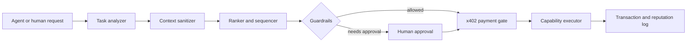

# ClawCompass

**A capability broker for autonomous agents.** An agent describes its task; ClawCompass picks the right skill, MCP server, plugin or sub-agent, strips secrets from the context, and holds risky or paid actions until a human approves.

Built at the OpenClaw Hack (Toronto Tech Week), 26 May 2026, Toronto Metropolitan University.

## Why it exists

Agent builders lose time choosing and trusting tools. The number of skills, plugins, MCP servers and sub-agents keeps growing, and an agent that picks the wrong one can leak a secret or spend money without permission. ClawCompass puts one broker between the agent and its tools.

## What it does

| Step | What happens |
|---|---|
| Analyse | Classifies the task, budget and risk tolerance with an LLM, with a deterministic fallback when no API key is set |
| Redact | Removes 10 kinds of secrets (API keys, private keys, JWTs, database URLs, seed phrases, emails and more) before any tool sees the context |
| Rank | Scores each capability on task fit, trust, success rate, safety, price and permission count |
| Gate | Requires human approval for write, wallet, external-message and unverified-tool actions |
| Pay | Blocks paid capabilities until an x402 payment is verified |
| Execute and record | Runs the capability on the redacted input, then logs the transaction and a reputation event |

## At a glance

- TypeScript end to end: Express API, React and Vite dashboard
- About 4,350 lines of application code and 37 automated tests (Vitest), all passing
- 20 API routes covering buyer, seller, approval, payment, proof and reputation flows
- 7 seeded capabilities across low, medium and high risk levels
- Works offline: no API key or wallet is needed to run the demo

## How it works



Main modules, all in `src/services/`:

- `taskAnalyzer`: task type, budget and risk classification (Anthropic SDK, deterministic fallback)
- `contextSanitizer`: pattern-based secret redaction with a safe sharing preview
- `capabilityRanker` and `capabilitySequencer`: weighted scoring and ordering of capabilities
- `guardrails`: approval policy for risky actions
- `paymentGate` and `paymentAdapter`: transaction state and x402 order handling
- `executor`: runs capabilities on sanitized input
- `reputationLogger`: outcome tracking per capability
- `telegramBridge`: optional chat interface to the same command handler

## Run it locally

Requires Node.js 20.19 or newer.

```bash
git clone https://github.com/PATELOM925/openclaw-hack-ttw26.git
cd openclaw-hack-ttw26
npm install
cp .env.example .env        # optional; the demo runs without keys

npm run dev                 # API on http://localhost:3000
npm run dev:web             # dashboard on http://localhost:5173
```

Set `ENABLE_MOCK_X402=true` in `.env` to settle payments locally during a demo.

Dashboard routes:

- `/` broker workflow: task intake, payment, execution, transactions, reputation
- `/buy` buyer-agent workflow: context analysis, recommendation, purchase, execution
- `/sell` seller marketplace: listed capabilities and provider submissions

## Tests

```bash
npm run validate            # type-check build, then all tests
```

The 37 tests cover the API routes, the broker services (ranking, redaction, guardrails, payment gate, proof status) and the Telegram bridge.

## Demo

- Recording: [`docs/demo-recordings/clawcompass-transactions-qa-2026-05-26.webm`](docs/demo-recordings/clawcompass-transactions-qa-2026-05-26.webm)
- Judge deck: [`docs/presentations/clawcompass_final_judge_demo.pptx`](docs/presentations/clawcompass_final_judge_demo.pptx)
- Architecture notes: [`docs/hackathon/clawcompass/ARCHITECTURE.md`](docs/hackathon/clawcompass/ARCHITECTURE.md)

## Status and limits

This is a hackathon MVP that runs locally.

- Payments in the demo use mock settlement. The real x402 path is wired through `goatx402-sdk-server` and needs merchant credentials and a funded wallet.
- On-chain identity (ERC-8004) and mainnet registration stay behind explicit approval gates and were not completed end to end.
- Data is seeded and held in memory; there is no database.
- ClawCompass works beside OpenClaw and ClawUp. It does not modify the OpenClaw runtime.

## Team
Om Patel led the design and build of the broker core, API, dashboard and tests, working with Awais and Abhinav Singh at the hackathon.
